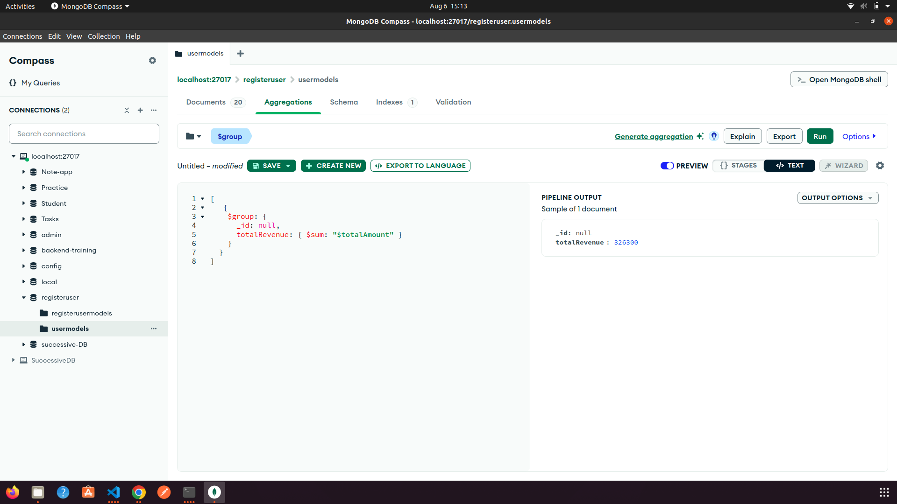
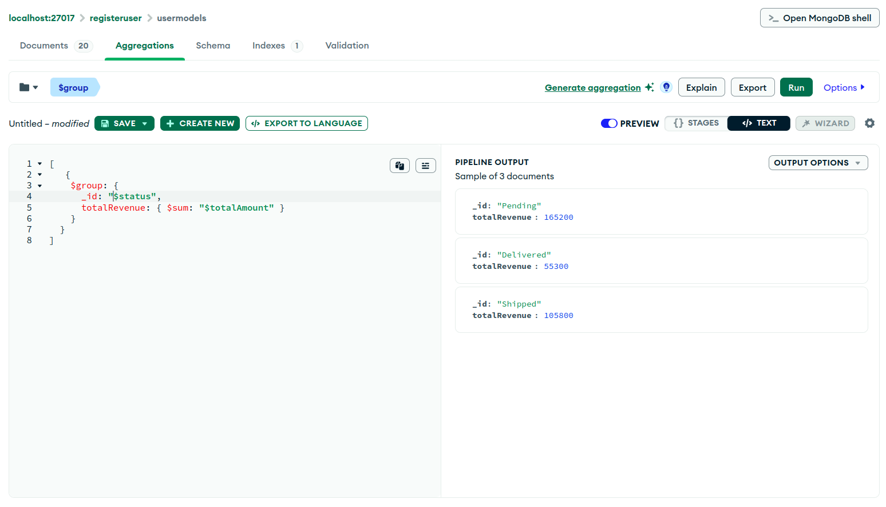
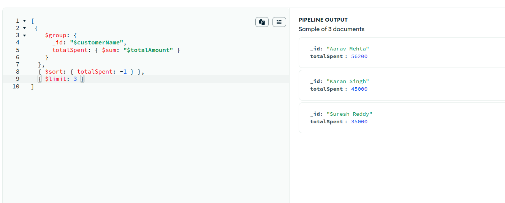
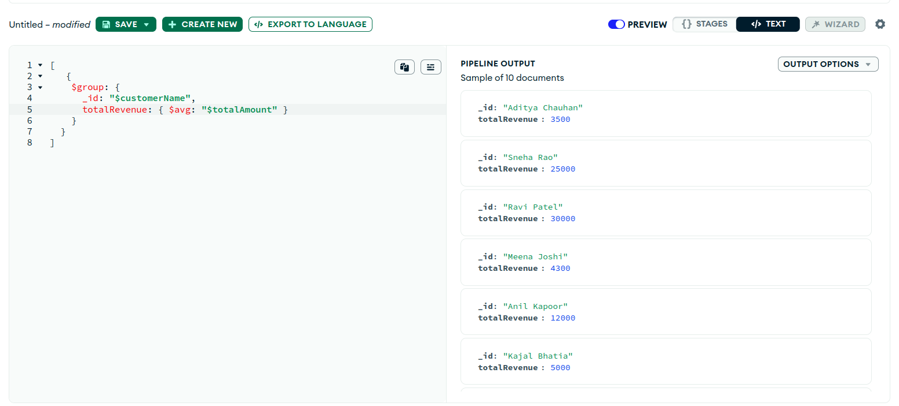
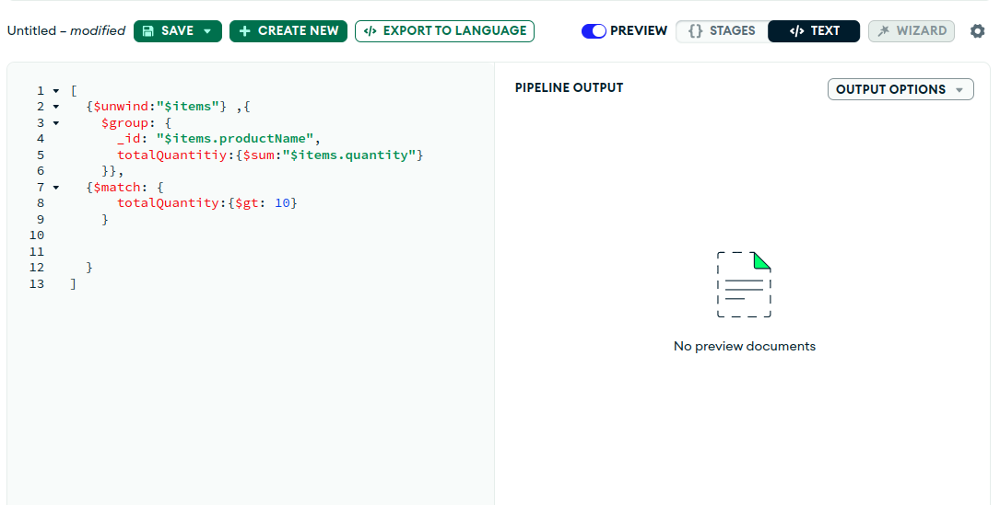
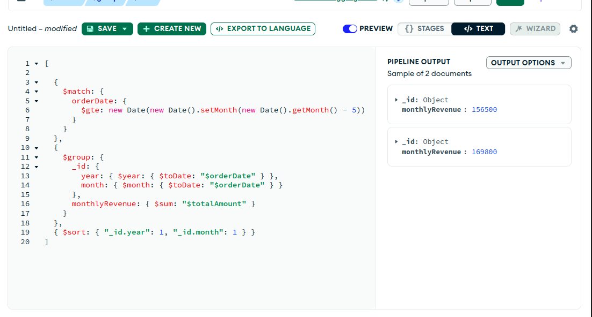
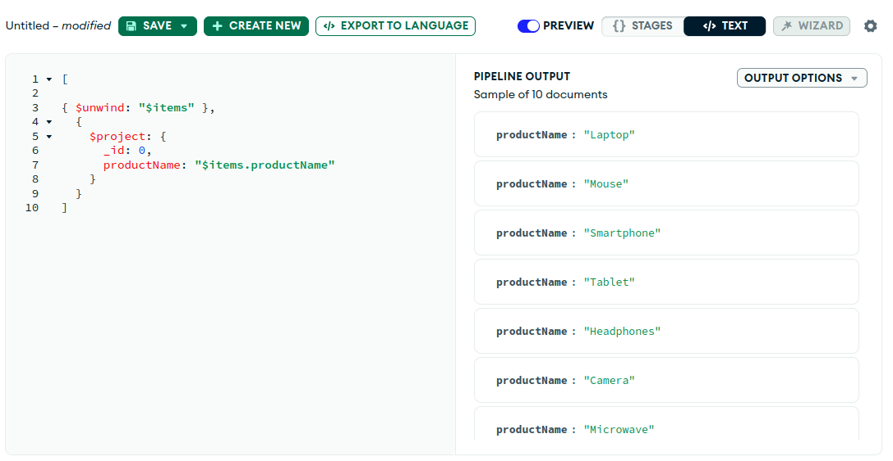
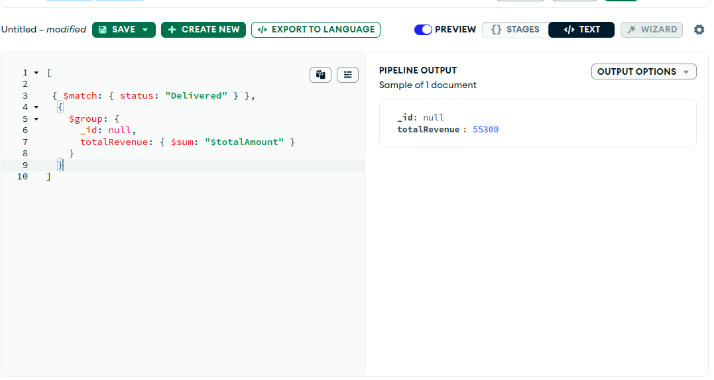
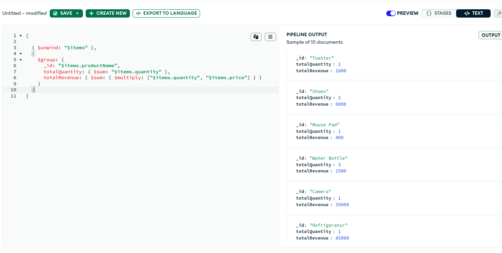

# MongoDB Aggregation Framework

## What is Aggregation?

Aggregation in MongoDB is a powerful way to process data and return computed results. It works by passing documents through a pipeline that transforms the data into an aggregated result.

## Aggregation Pipeline

The aggregation pipeline is a framework for data aggregation modeled on the concept of data processing pipelines. Documents enter a multi-stage pipeline that can transform them and output the aggregated result.

Each stage transforms the documents as they pass through the pipeline. Common stages include:

### 1. `$match`

Filters the documents to pass only the documents that match the specified condition(s).

```js
{
  $match: {
    status: "Delivered";
  }
}
```

### 2. `$group`

Groups input documents by a specified identifier expression and applies the accumulator expressions (like `$sum`, `$avg`, etc.)

```js
{
  $group: {
    _id: "$customerName",
    totalSpent: { $sum: "$totalAmount" }
  }
}
```

### 3. `$project`

Used to include, exclude, or add new fields.

```js
{
  $project: {
    productName: "$items.productName";
  }
}
```

### 4. `$sort`

Sorts all input documents and returns them to the pipeline in sorted order.

```js
{
  $sort: {
    totalAmount: -1;
  }
}
```

### 5. `$limit`

Limits the number of documents passed to the next stage.

```js
{
  $limit: 5;
}
```

### 6. `$unwind`

Deconstructs an array field from the input documents to output a document for each element.

```js
{
  $unwind: "$items";
}
```

## Example Use Cases

- Calculating total revenue.
- Finding top customers.
- Listing monthly sales.
- Analyzing product performance.

## Benefits

- Simplifies complex data transformations.
- Reduces need for multiple queries or application-side processing.
- Increases performance for data analytics.

## Conclusion

MongoDB’s aggregation framework is an efficient and flexible way to perform data analysis directly within the database. By chaining multiple stages in a pipeline, you can extract meaningful insights and summaries from your data.

## Sample json
```json
export const data = [
  {
    "orderId": "ORD1001",
    "customerName": "Aarav Mehta",
    "orderDate": "2025-08-01",
    "status": "Pending",
    "items": [
      { "productName": "Laptop", "quantity": 1, "price": 55000 },
      { "productName": "Mouse", "quantity": 2, "price": 600 }
    ],
    "totalAmount": 56200
  },
  {
    "orderId": "ORD1002",
    "customerName": "Sneha Rao",
    "orderDate": "2025-07-28",
    "status": "Shipped",
    "items": [
      { "productName": "Smartphone", "quantity": 1, "price": 25000 }
    ],
    "totalAmount": 25000
  },
  {
    "orderId": "ORD1003",
    "customerName": "Rahul Verma",
    "orderDate": "2025-08-02",
    "status": "Delivered",
    "items": [
      { "productName": "Tablet", "quantity": 1, "price": 18000 },
      { "productName": "Headphones", "quantity": 1, "price": 1500 }
    ],
    "totalAmount": 19500
  },
  {
    "orderId": "ORD1004",
    "customerName": "Pooja Sharma",
    "orderDate": "2025-07-30",
    "status": "Pending",
    "items": [
      { "productName": "Camera", "quantity": 1, "price": 35000 }
    ],
    "totalAmount": 35000
  },
  {
    "orderId": "ORD1005",
    "customerName": "Anil Kapoor",
    "orderDate": "2025-07-25",
    "status": "Delivered",
    "items": [
      { "productName": "Microwave", "quantity": 1, "price": 12000 }
    ],
    "totalAmount": 12000
  },
  {
    "orderId": "ORD1006",
    "customerName": "Divya Nair",
    "orderDate": "2025-08-01",
    "status": "Shipped",
    "items": [
      { "productName": "Printer", "quantity": 1, "price": 8000 },
      { "productName": "Ink Cartridge", "quantity": 2, "price": 1500 }
    ],
    "totalAmount": 11000
  },
  {
    "orderId": "ORD1007",
    "customerName": "Karan Singh",
    "orderDate": "2025-08-03",
    "status": "Pending",
    "items": [
      { "productName": "Refrigerator", "quantity": 1, "price": 45000 }
    ],
    "totalAmount": 45000
  },
  {
    "orderId": "ORD1008",
    "customerName": "Meena Joshi",
    "orderDate": "2025-08-04",
    "status": "Delivered",
    "items": [
      { "productName": "Blender", "quantity": 1, "price": 2500 },
      { "productName": "Toaster", "quantity": 1, "price": 1800 }
    ],
    "totalAmount": 4300
  },
  {
    "orderId": "ORD1009",
    "customerName": "Ravi Patel",
    "orderDate": "2025-07-29",
    "status": "Shipped",
    "items": [
      { "productName": "Washing Machine", "quantity": 1, "price": 30000 }
    ],
    "totalAmount": 30000
  },
  {
    "orderId": "ORD1010",
    "customerName": "Nisha Yadav",
    "orderDate": "2025-08-01",
    "status": "Pending",
    "items": [
      { "productName": "Shoes", "quantity": 2, "price": 3000 }
    ],
    "totalAmount": 6000
  },
  {
    "orderId": "ORD1011",
    "customerName": "Vikram Sinha",
    "orderDate": "2025-08-05",
    "status": "Pending",
    "items": [
      { "productName": "Monitor", "quantity": 1, "price": 12000 }
    ],
    "totalAmount": 12000
  },
  {
    "orderId": "ORD1012",
    "customerName": "Ritika Ghosh",
    "orderDate": "2025-07-27",
    "status": "Delivered",
    "items": [
      { "productName": "Electric Kettle", "quantity": 1, "price": 2000 },
      { "productName": "Water Bottle", "quantity": 3, "price": 500 }
    ],
    "totalAmount": 3500
  },
  {
    "orderId": "ORD1013",
    "customerName": "Suresh Reddy",
    "orderDate": "2025-07-28",
    "status": "Shipped",
    "items": [
      { "productName": "AC", "quantity": 1, "price": 35000 }
    ],
    "totalAmount": 35000
  },
  {
    "orderId": "ORD1014",
    "customerName": "Kajal Bhatia",
    "orderDate": "2025-08-06",
    "status": "Pending",
    "items": [
      { "productName": "Fitness Tracker", "quantity": 1, "price": 5000 }
    ],
    "totalAmount": 5000
  },
  {
    "orderId": "ORD1015",
    "customerName": "Yash Thakur",
    "orderDate": "2025-07-30",
    "status": "Delivered",
    "items": [
      { "productName": "Bookshelf", "quantity": 1, "price": 7000 }
    ],
    "totalAmount": 7000
  },
  {
    "orderId": "ORD1016",
    "customerName": "Neha Kapoor",
    "orderDate": "2025-08-01",
    "status": "Shipped",
    "items": [
      { "productName": "Desk Lamp", "quantity": 2, "price": 1200 }
    ],
    "totalAmount": 2400
  },
  {
    "orderId": "ORD1017",
    "customerName": "Aditya Chauhan",
    "orderDate": "2025-08-02",
    "status": "Pending",
    "items": [
      { "productName": "Bluetooth Speaker", "quantity": 1, "price": 3500 }
    ],
    "totalAmount": 3500
  },
  {
    "orderId": "ORD1018",
    "customerName": "Rashmi Desai",
    "orderDate": "2025-07-31",
    "status": "Delivered",
    "items": [
      { "productName": "Office Chair", "quantity": 1, "price": 9000 }
    ],
    "totalAmount": 9000
  },
  {
    "orderId": "ORD1019",
    "customerName": "Siddharth Malhotra",
    "orderDate": "2025-08-05",
    "status": "Pending",
    "items": [
      { "productName": "Webcam", "quantity": 1, "price": 2500 }
    ],
    "totalAmount": 2500
  },
  {
    "orderId": "ORD1020",
    "customerName": "Priya Rane",
    "orderDate": "2025-08-06",
    "status": "Shipped",
    "items": [
      { "productName": "Keyboard", "quantity": 1, "price": 2000 },
      { "productName": "Mouse Pad", "quantity": 1, "price": 400 }
    ],
    "totalAmount": 2400
  }
]

```

## Aggregation Questions

1. Find total revenue generated (sum of totalAmount).



2. Find total revenue generated (sum of totalAmount).





3. Find the top 3 customers who spent the most (sort by totalAmount).




4. Get the average order amount per customer




5. Find products that were sold more than 10 times (total quantity)



6. List monthly revenue (group by month-year) for the last 6 months.



7. Extract only the product names from all orders using $unwind and $project



8. Apply filtering using $match (only Delivered orders) and then calculate revenue.



9. Calculate total quantity and total revenue per product (use $unwind and $group).




